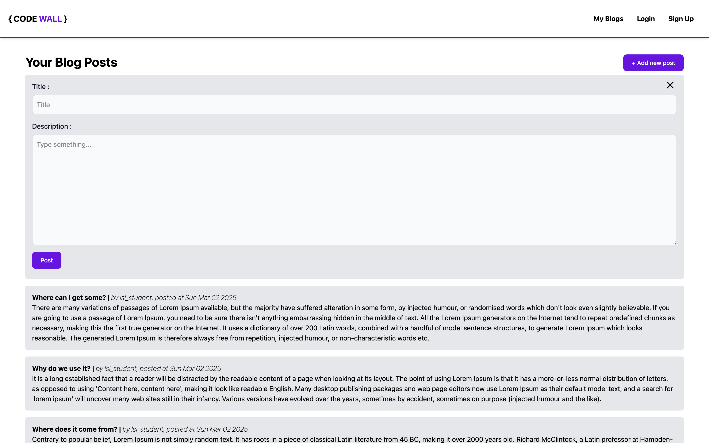

# Mini-Blog

## Introduction

Ce projet met en place un système de blog en JavaScript permettant aux utilisateurs de créer des articles et de les afficher dynamiquement sur une page web. L'application utilise la manipulation du DOM pour gérer les interactions utilisateur et met en œuvre la programmation orientée objet pour structurer les données.

## 1. Classes Implémentées

**1.1 Classe User**

Permet de créer un utilisateur avec un username.

Convertit l'objet utilisateur en `JSON (toJson())`.

Peut être reconstitué à partir d'un `JSON (fromJson())`.

**1.2 Classe Post**

Représente un article de blog avec `title`, `description`, `user` et `createdAt`.

Convertit un article en `JSON (toJson())`.

Peut être récupéré à partir d'un `JSON (fromJson())`.

## 2. Fonctionnalités

Demande d'un nom d'utilisateur via `prompt()` avant de pouvoir poster.

Affichage et masquage du formulaire via des boutons d'interaction.

Ajout dynamique des posts sur la page HTML.

Utilisation de la programmation orientée objet (POO) pour structurer les données.
